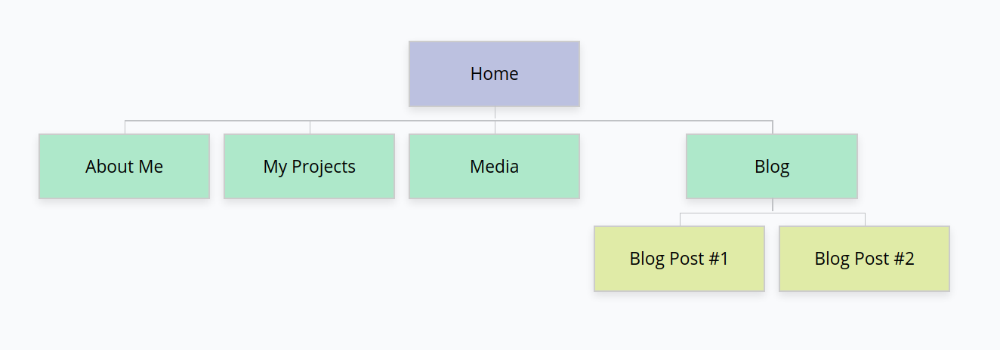

# Portfolio for James Menzies

**Required External Links:**   [Github Repo](https://github.com/redbrickhut/James_Menzies_Portfolio) |  [Hosted Website]() | <a href="docs/wireframes.pdf" target="_blank">Wireframes</a>

## Target Audience

Given my background as a professional musician, I have a rare opportunity to corner an area of the market that most programmers don't. This namely being musicians who are in need of a developer, but also require someone who has a knowledge of the nuances and jargon of the musical profession as well.\
\
Whilst the intention is to optimize my website towards this demographic, I am mindful to make sure that it caters towards all potential employers as well.
## Purpose of Website

There are four core purposes of this website:
1. I want to make it as efficient as possible for employers to find my credentials and contact details.
2. I want to showcase my work in a more interactive way than is possible with a standard Github repository. I also want to cater to those that might feel apprehensive about visiting Github as well.
3. I want to demonstrate my capabilities through the working integrity of the website.
4. I want to showcase my life as a professional musician. The aim is to create a unique impression for those who aren't from my background, and to affirm my integrity to those that are.

## Functionality and Features

### The Navigation Shell

A big component of the design brief was to both create a uniform look and to create a responsive site layout with distinct mobile and desktop versions. No component plays a bigger role in this than the navigation shell. It has three distinct parts:

1. A header, which displays the name of the current page, as well as a menu button.
2. A menu, which allows the user to travel to a different page
3. A footer, which provides links to external websites (such as LinkedIn and Github pages).

It also has three distinct modes:

| Name | Width | Function |
| --- | --- | ---|
| Mobile | <600px | Menu is hidden by default, pressing the menu button will cause the menu to appear vertically. The effect is animated. | 
| Tablet | <950px | As above, but menu appears from the left hand side. |
|Desktop | >950px | Menu is always visible, menu button is disabled and removed. Icons are repositioned.

## Site Map

Due to the relative simplicity of the website, most of it is accessible within a single click from the home page. The only exceptions are the blog posts, which by necessity must be broken up to reduce crowding. 

## Tech Stack
* HTML
* CSS
* Git
* Github

## Screenshots

